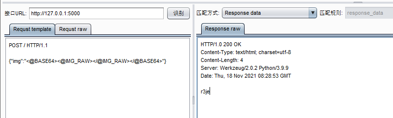

## 为ddddocr提供供captcha-killer调用的web接口

> 环境：python 3.9.9
>
> 依赖：flask, ddddocr （均可通过pip安装）

配好环境，安装依赖。

clone项目，到app.py文件夹下。

执行`flask run`命令，启动flask web服务。

+ 接口URL就是web服务的地址，默认是`http://127.0.0.1:5000`。

+ 请求模板如下：

	```http
	POST / HTTP/1.1
	
	{"img":"<@BASE64><@IMG_RAW></@IMG_RAW></@BASE64>"}
	```

+ 匹配方式`Response data`



